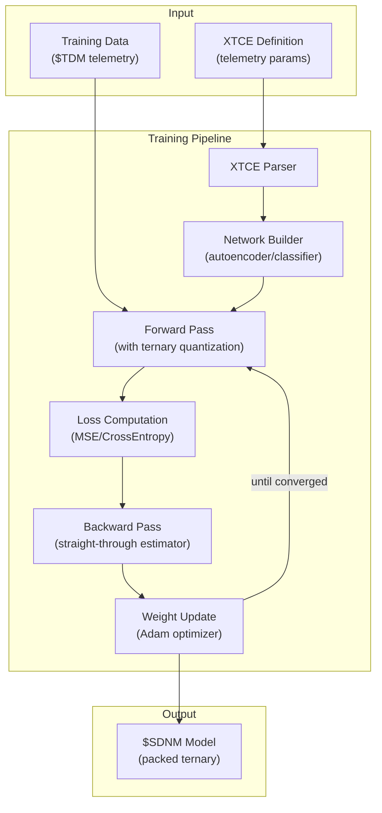
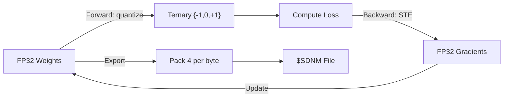

# 🏋️ ML Training Plugin

[](https://github.com/the-lobsternaut/ml-train-sdn-plugin/actions)
[](LICENSE)
[](https://en.cppreference.com/w/cpp/17)
[](wasm/)
[](https://github.com/the-lobsternaut)

**Train compact BitNet-style neural networks for satellite telemetry anomaly detection — quantization-aware training with ternary weights {-1, 0, +1}, XTCE telemetry definitions, and compact model serialization.**

---

## Overview

The ML Training plugin provides the training counterpart to the ML Inference plugin. It trains small, quantized neural networks that can run on resource-constrained hardware (CubeSat OBCs, ARM MCUs) for real-time anomaly detection in satellite telemetry.

### Key Features

- **XTCE parser** — reads XML Telemetric and Command Exchange definitions to auto-configure network input dimensions
- **Quantization-aware training** — trains with straight-through estimators for ternary weight quantization
- **Architecture support** — autoencoder (anomaly detection), classifier (fault type), predictor (forecasting)
- **Tensor library** — self-contained tensor operations (no PyTorch/TensorFlow dependency)
- **Model serialization** — compact `$SDNM` format with packed ternary weights (4 values per byte)

---

## Architecture



### Quantization-Aware Training



---

## Research & References

- Ma, S. et al. (2024). ["The Era of 1-bit LLMs: All Large Language Models are in 1.58 Bits"](https://arxiv.org/abs/2402.17764). BitNet b1.58 — ternary quantization.
- Bengio, Y. et al. (2013). ["Estimating or Propagating Gradients Through Stochastic Neurons"](https://arxiv.org/abs/1308.3432). Straight-through estimator for quantized training.
- **CCSDS 505.0-B-2** — XTCE: XML Telemetric and Command Exchange. Standard for telemetry parameter definitions.
- **CCSDS 504.0-B-1** — Telemetry Data Messages (TDM).

---

## Technical Details

### Training Configuration

| Parameter | Default | Description |
|-----------|---------|-------------|
| Learning rate | 0.001 | Adam optimizer |
| Epochs | 100 | Training iterations |
| Batch size | 32 | Mini-batch size |
| Hidden layers | [64, 32, 64] | Autoencoder architecture |
| Activation | ReLU | Hidden layer activation |
| Quantization | Ternary | Weight quantization mode |
| Threshold | 0.33 | Ternary quantization threshold |

### XTCE Telemetry Parameters

The XTCE parser extracts:
- Parameter names, types, units
- Engineering unit calibrations
- Valid range constraints
- Alarm thresholds

These auto-configure the network input dimensions and normalization parameters.

### Model Output Format (`$SDNM`)

Compact binary with packed ternary weights:
- **Compression**: 4 ternary values per byte (75% smaller than int8)
- **Typical model size**: 5–50 KB for satellite telemetry models
- **Zero-copy inference**: direct memory-mapped loading

---

## Build Instructions

```bash
git clone --recursive https://github.com/the-lobsternaut/ml-train-sdn-plugin.git
cd ml-train-sdn-plugin

mkdir -p build && cd build
cmake ../src/cpp -DCMAKE_CXX_STANDARD=17
make -j$(nproc)
ctest --output-on-failure
```

---

## Usage Examples

```cpp
#include "ml_train/training.h"
#include "ml_train/xtce_parser.h"

// Parse XTCE for auto-config
auto params = ml_train::parseXTCE("satellite_telemetry.xml");
auto config = ml_train::autoConfigNetwork(params, ml_train::ArchType::AUTOENCODER);

// Train
ml_train::TrainingConfig tc;
tc.epochs = 100;
tc.learningRate = 0.001;
tc.quantMode = ml_train::QuantMode::TERNARY;

auto model = ml_train::train(trainingData, config, tc);

// Save compact model
ml_train::saveModel(model, "anomaly_detector.sdnm");
```

---

## Plugin Manifest

```json
{
  "schemaVersion": 1,
  "name": "ml-train-sdn-plugin",
  "version": "0.1.0",
  "description": "Train BitNet-style neural networks for satellite telemetry anomaly detection with XTCE support.",
  "author": "DigitalArsenal",
  "license": "MIT",
  "inputs": ["$XTCE", "$TDM"],
  "outputs": ["$SDNM"]
}
```

---

## License

MIT — see [LICENSE](LICENSE) for details.

---

*Part of the [Space Data Network](https://github.com/the-lobsternaut) plugin ecosystem.*
